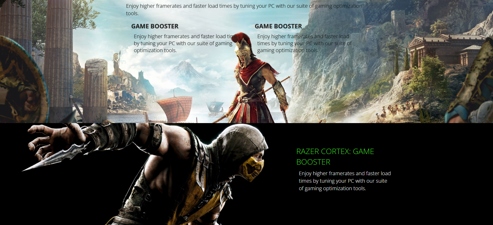

# RAZOR-GAMES

My First Web project using PHP, MySQL, CSS. `RAZOR GAMES`





### Built With

- [PHP](https://www.php.net/)
- [HTML](https://www.w3schools.com/html/)
- [CSS](https://www.w3schools.com/css/)
- [MySql](https://www.mysql.com/)

### Tools

- [WampServer](https://www.wampserver.com/en/)
- [Brackets IDE](https://brackets.io/)

### Installation

_Dowmload and install wampserver and start the service._

1. Start wampserver.
2. Clone the repo to `C:\wamp64\www\RAZOR`

   ```sh
   git clone https://github.com/ThilinaSatoru/RAZOR-GAMES.git
   ```

3. Go to `http://localhost/phpmyadmin/`

   - Login,
   - Create database `razor`.
   - Import `razor.sql` from the directory.

4. Open your browser and address to,
   ```
   http://localhost/RAZOR/PUBLICS/home.php
   ```


## Shopping Cart


## Admin Panel


